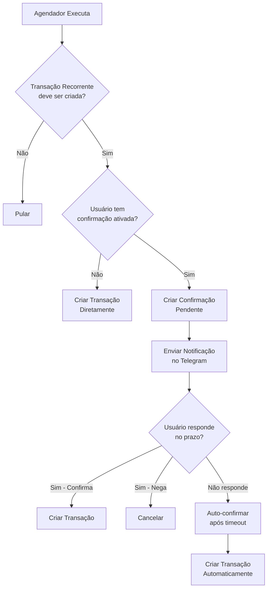

# 🔔 Sistema de Confirmação de Transações Recorrentes

## 📋 **Visão Geral**

Sistema **opcional** que permite ao usuário receber notificações no Telegram pedindo confirmação antes de criar transações recorrentes automaticamente.

- **🔧 Configurável**: O usuário escolhe se quer ou não receber confirmações
- **⏰ Flexível**: Timeout configurável de 1 a 24 horas
- **🤖 Automático**: Se não responder no prazo, a transação é criada automaticamente
- **🔗 Integrado**: Funciona perfeitamente com o sistema de notificações existente

---

## 🏗️ **Arquitetura**

### **1. Configuração do Usuário**

**Localização:** Página do Telegram (`/telegram`)

**Campos adicionados no modelo `TelegramUser`:**
- `confirmar_transacoes_recorrentes` (Boolean, padrão: `False`)
- `timeout_confirmacao_horas` (Integer, padrão: `2`)

**Opções de timeout:**
- 1h, 2h, 4h, 6h, 12h, 24h

### **2. Fluxo de Processamento**



### **3. Estados da Confirmação**

```typescript
type StatusConfirmacao = 
  | 'pendente'        // Aguardando resposta do usuário
  | 'confirmada'      // Usuário confirmou - transação criada
  | 'negada'          // Usuário negou - não criar transação
  | 'auto_confirmada' // Timeout - transação criada automaticamente
```

---

## 🛠️ **Implementação Técnica**

### **Backend**

#### **1. Modelo de Dados**

```sql
-- Adicionado na tabela telegram_users
ALTER TABLE telegram_users ADD COLUMN confirmar_transacoes_recorrentes BOOLEAN DEFAULT FALSE;
ALTER TABLE telegram_users ADD COLUMN timeout_confirmacao_horas INTEGER DEFAULT 2;

-- Tabela de confirmações (já existente)
CREATE TABLE confirmacao_transacao (
    id SERIAL PRIMARY KEY,
    transacao_recorrente_id INTEGER REFERENCES transacao_recorrente(id),
    telegram_user_id VARCHAR NOT NULL,
    status VARCHAR DEFAULT 'pendente',
    expira_em TIMESTAMP NOT NULL,
    transacao_id INTEGER REFERENCES transacao(id),
    -- ... outros campos
);
```

#### **2. Serviços Modificados**

**`AgendadorService`:**
- `_processar_transacao_individual()`: Verifica se usuário quer confirmação
- `_criar_confirmacao()`: Cria confirmação pendente + notificação
- `_criar_transacao_direta()`: Comportamento padrão (sem confirmação)
- `processar_confirmacoes_expiradas()`: Processa timeouts

**Fluxo de decisão:**
```python
if telegram_user and telegram_user.confirmar_transacoes_recorrentes:
    # Criar confirmação + enviar notificação
    resultado = AgendadorService._criar_confirmacao(...)
else:
    # Criar transação diretamente (padrão)
    resultado = AgendadorService._criar_transacao_direta(...)
```

#### **3. APIs Criadas**

**Configuração:**
- `PATCH /api/telegram/config/confirmacao-recorrentes` - Alterar configurações
- `GET /api/telegram/config/confirmacao-recorrentes` - Obter configurações atuais

**Processamento (futuro):**
- `POST /api/telegram/confirmar/{confirmacao_id}` - Confirmar transação
- `POST /api/telegram/negar/{confirmacao_id}` - Negar transação

### **Frontend**

#### **Página do Telegram (`TelegramPage.tsx`)**

**Seção de Configurações** (aparece apenas se Telegram conectado):

```typescript
interface ConfigConfirmacao {
  ativo: boolean;
  timeout_horas: number;
}
```

**Funcionalidades:**
- ✅ Toggle para ativar/desativar confirmação
- ⏰ Dropdown para escolher timeout (1-24h)
- 💾 Salvamento automático das configurações
- 📱 Feedback visual de sucesso/erro
- ℹ️ Explicação completa de como funciona

---

## 🔄 **Integração com Sistema Existente**

### **Agendador Unificado**

O método `AgendadorService.executar_agendamentos()` agora processa:

1. **Transações Recorrentes** - Cria transações diretas OU confirmações
2. **Confirmações Expiradas** - Auto-confirma transações com timeout

### **Webhook do Cron Job**

**URL:** `https://financeiro-amd5aneeemb2c9bv.canadacentral-01.azurewebsites.net/api/agendador/webhook/executar?webhook_key=financas-ai-webhook-2024`

**Execução:** Toda hora (00:00, 01:00, 02:00, ...)

**Resultado unificado:**
```json
{
  "resumo": {
    "transacoes_criadas": 3,           // Transações diretas
    "confirmacoes_criadas": 2,         // Confirmações pendentes
    "confirmacoes_auto_processadas": 1, // Timeouts processados
    "total_processado": 6
  }
}
```

---

## 🎯 **Casos de Uso**

### **Cenário 1: Usuário SEM confirmação (padrão)**
```
09:00 - Agendador executa
09:00 - Transação "Aluguel R$ 1.200" criada automaticamente
✅ Comportamento atual mantido
```

### **Cenário 2: Usuário COM confirmação - Confirma**
```
09:00 - Agendador executa
09:00 - Confirmação criada (expira em 2h)
09:01 - Telegram: "Confirmar Aluguel R$ 1.200? Sim/Não"
09:15 - Usuário: "Sim"
09:15 - Transação criada
✅ Usuário teve controle
```

### **Cenário 3: Usuário COM confirmação - Timeout**
```
09:00 - Agendador executa
09:00 - Confirmação criada (expira em 2h)
09:01 - Telegram: "Confirmar Aluguel R$ 1.200? Sim/Não"
11:00 - Agendador executa novamente
11:00 - Confirmação expirada → Transação criada automaticamente
✅ Sistema não trava se usuário não responder
```

### **Cenário 4: Usuário COM confirmação - Nega**
```
09:00 - Agendador executa
09:00 - Confirmação criada (expira em 2h)
09:01 - Telegram: "Confirmar Aluguel R$ 1.200? Sim/Não"
09:15 - Usuário: "Não"
09:15 - Confirmação marcada como "negada"
✅ Transação não criada
```

---

## 🚀 **Status da Implementação**

### ✅ **Concluído**

- [x] Modelo de dados atualizado
- [x] Migração SQL criada
- [x] Lógica de decisão no agendador
- [x] APIs de configuração
- [x] Interface frontend completa
- [x] Processamento de timeouts
- [x] Integração com webhook existente
- [x] Documentação completa

### 🔄 **Próximos Passos**

- [ ] Implementar envio de notificação via TelegramService
- [ ] Criar comandos do bot para responder confirmações
- [ ] APIs para processar respostas (confirmar/negar)
- [ ] Testes de integração completos

---

## 📱 **Interface do Usuário**

### **Como o usuário vê:**

1. **Página do Telegram:** Seção "Configurações Avançadas" 
2. **Toggle:** "Pedir confirmação via Telegram"
3. **Dropdown:** Timeout configurável
4. **Explicação:** Como funciona o sistema
5. **Feedback:** Confirmação visual das alterações

### **UX/UI:**
- 🎨 Design consistente com o resto da aplicação
- 📱 Responsivo para mobile
- ✨ Animações suaves nos toggles
- 🛡️ Validação em tempo real
- ℹ️ Tooltips e explicações claras

---

## 🔐 **Segurança e Confiabilidade**

- **Fallback:** Se o sistema de confirmação falhar, cria transação normalmente
- **Timeout:** Garante que o sistema nunca "trava"
- **Logs:** Rastreamento completo de todas as operações
- **Validação:** Timeout entre 1-24h obrigatório
- **Permissões:** Apenas usuários autenticados no Telegram

---

## 📊 **Monitoramento**

**Logs incluem:**
- 📋 Confirmações criadas
- ⏰ Timeouts processados
- ✅ Transações confirmadas/negadas
- 🔄 Status de cada processamento
- ❌ Erros e recuperações

**Exemplo de log:**
```
INFO - 📋 Confirmação criada: [AUTO] Aluguel - ID: 123
INFO - ⏰ Transação auto-confirmada: [AUTO] Aluguel - R$ 1200.00
INFO - ✅ Agendamentos concluídos - transações: 2, confirmações: 1
```

---

## 🎉 **Conclusão**

Sistema **100% opcional** que oferece **máximo controle** ao usuário sem quebrar o comportamento padrão.

**Benefícios:**
- ✅ Usuário pode revisar transações antes da criação
- ✅ Evita transações indesejadas
- ✅ Funciona perfeitamente com o sistema atual
- ✅ Interface intuitiva e configurável
- ✅ Fallback automático em caso de não resposta

**Para usuários que querem o máximo de controle sobre suas finanças! 💎**

---

## 🔀 **Resolução de Conflitos entre Usuários**

### **Problema:**
Em um tenant com vários usuários, quem deve receber a notificação de confirmação?

### **Solução Implementada:**

#### **1. Prioridade por Criador**
```python
# 1º: Busca o usuário que CRIOU a transação recorrente
if transacao_recorrente.created_by_name:
    telegram_user = buscar_por_nome(created_by_name)
    
# 2º: Se não encontrar, busca qualquer usuário com confirmação ativada
if not telegram_user:
    telegram_user = buscar_qualquer_usuario_com_confirmacao()
```

#### **2. Cenários de Resolução:**

**Cenário A: Usuário Criador tem Telegram + Confirmação**
```
✅ João cria transação recorrente "Netflix"
✅ João tem Telegram conectado
✅ João tem confirmação ativada
→ João recebe a notificação
```

**Cenário B: Usuário Criador não tem Confirmação**
```
⚠️ João cria transação recorrente "Netflix"
❌ João não tem confirmação ativada
✅ Maria (mesmo tenant) tem confirmação ativada
→ Maria recebe a notificação + log de aviso
```

**Cenário C: Múltiplos Usuários com Confirmação**
```
⚠️ João cria transação recorrente "Netflix"
❌ João não tem Telegram conectado
✅ Maria tem confirmação ativada
✅ Pedro tem confirmação ativada
→ Sistema pega o PRIMEIRO encontrado (Maria)
📝 Log registra a escolha
```

#### **3. Logs de Rastreamento:**

```
INFO - ✅ Confirmação enviada para criador: João
WARN - ⚠️ Transação criada por 'João' - usando configuração de 'Maria'
INFO - 📋 Confirmação criada por: João, notificação para: Maria
```

#### **4. Registro na Confirmação:**

```sql
-- Tabela confirmacoes_transacao
criada_por_usuario = "João Silva"        -- Quem criou a transação recorrente
telegram_user_id = "maria_telegram_123"  -- Quem vai receber a notificação
```

### **Vantagens da Solução:**

- ✅ **Prioriza o criador** (mais lógico)
- ✅ **Fallback inteligente** se criador não disponível
- ✅ **Rastreamento completo** via logs
- ✅ **Evita spam** (só um usuário recebe)
- ✅ **Transparência** sobre quem está notificando quem

### **Futuras Melhorias:**

1. **Interface Admin:** Definir quem recebe notificações por categoria
2. **Configuração por Transação:** Escolher destinatário específico
3. **Notificação Múltipla:** Opção de notificar vários usuários
4. **Hierarquia de Permissões:** Admin > Criador > Qualquer usuário

--- 